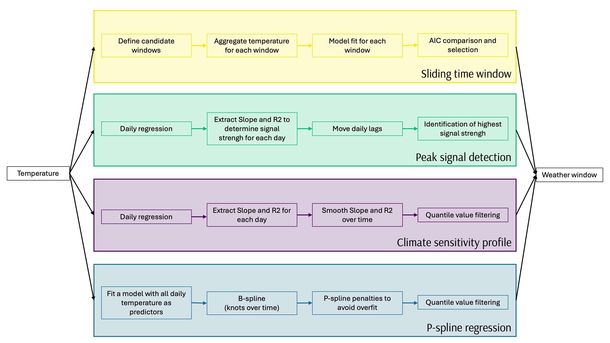

<!-- README.md is generated from README.Rmd. Please edit that file -->

# weatheRcues 

<!-- badges: start -->

<!-- badges: end -->

<p align="left">

• <a href="#overview">Overview</a><br> •
<a href="#features">Features</a><br> •
<a href="#installation">Installation</a><br> •
<a href="#get-started">Get started</a><br> •
<a href="#long-form-documentations">Long-form documentations</a><br> •
<a href="#citation">Citation</a><br> •
<a href="#contributing">Contributing</a><br> •
<a href="#acknowledgments">Acknowledgments</a><br> •
<a href="#references">References</a>
</p>

## Overview

The `weatheRcues` R code was developed to make comparison of weather
cues method on biological data, here seed production data. The package
integrates existing R packages (e.g., `climwin`) alongside alternative
approaches, including methods adapted from Simmonds et al. and Thackeray
et al., now fully accessible through this R code package. This work is
part of an ongoing study (see here for more details
<https://ecoevorxiv.org/repository/view/9420/>). **Disclaimer**,
`weatheRcues` is not only a formal R package, but rather a research
compendium - organized with predefined files, folders structures,
functions in order to support reproducible research. All analysis are
based on a study example on European beech tree (*Fagus sylvatica*) were
we compared four methods to identify weather window of temperature
related to seed production, and models accuracy (see Journé et al, for
more details). Note also that you can still install “it” as a package if
you want to use the function for your own, please check the **Get
Started** section below.

## Features

The main purpose of `weatheRcues` is to compare different methods to
identify weather cues; i.e. what triggers or inhibitors of seed
production. Feel free to adjust the code for other variable you would be
interested in, such as tree ring data, phenological data, etc. We
included for now 4 methods, based on the following general workflow.

<figure>

<figcaption aria-hidden="true"><strong>Figure</strong>: Weather cue
detection - general workflow of the methods included in this R
package</figcaption>
</figure>

## Installation

You can install the development version from
[GitHub](https://github.com/) with:

``` r
## Install < remotes > package (if not already installed) ----
if (!requireNamespace("remotes", quietly = TRUE)) {
  install.packages("remotes")
}

## Install < weatheRcues > from GitHub ----
remotes::install_github("ValentinJourne/weatheRcues")
```

Then you can attach the package `weatheRcues`:

``` r
library("weatheRcues")
```

## Get started

`weatheRcues` provides for now one vignette to learn more about the
package:

- the [Get
  started](https://ValentinJourne.github.io/weatheRcues/articles/weatheRcues.html)
  vignette describes the core features of the package. Additional
  information about the methods can be found in Journé et al (in prep)

## Citation

Please cite `weatheRcues` as:

> Journé Valentin (2025) weatheRcues: a companion to identify weather
> cues in seed production. R package version 0.1.0
> <https://github.com/ValentinJourne/weatheRcues/>

And for the main study reference as:

> Journé Valentin, Emily G. Simmonds, Maciej Barczyk, Michał Bogdziewicz
> (2025) Comparing statistical methods for detecting weather cues of
> mast seeding in European beech (Fagus sylvatica) across Europe.
> Preprint: <https://ecoevorxiv.org/repository/view/9420/>

## Contributing

This code is mostly based on previous code and studies done on European
beech tree (see Journé et al, in prep for more details). Feel free to
adapt and modify the code for your own analyses and testing. If you have
any questions, suggestions, or have any issues with the code and
analysis, please do not hesitate to contact us.

## Acknowledgments

We would like to thank Martijn van de Pol, and Adrian Roberts for the
different methods they developed. We would also like Nicolas Casajus for
useful information related to code implementation (have a look on this
vignette
<https://frbcesab.github.io/rcompendium/articles/rcompendium.html> and R
package rcompendium if you are interested)

## Main References

Bailey, L.D. & van de Pol, M. (2016). Climwin: An R Toolbox for Climate
Window Analysis. PLoS ONE.

Roberts, A.M. (2008). Exploring relationships between phenological and
weather data using smoothing.International Journal of Biometeorology.

Thackeray, S.J., Henrys, P.A., Hemming, D., Bell, J.R., Botham, M.S.,
Burthe, S. et al. (2016). Phenological sensitivity to climate across
taxa and trophic levels. Nature.

Simmonds, E.G., Cole, E.F. & Sheldon, B.C. (2019). Cue identification in
phenology: A case study of the predictive performance of current
statistical tools. Journal of Animal Ecology.
